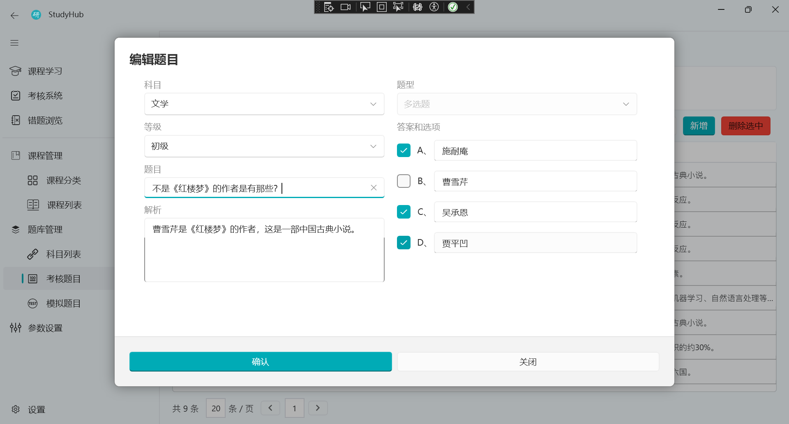

# StudyHub

基于 WPF 开发的学习和考核的客户端软件，支持题目录入、导入、导出，支持考试答题、错题重做、错题浏览、答题记录，课程同步、录入、播放等功能。

本项目仅供学习，禁止商用。

## 图片预览





## 发布

### 环境

`Window10`系统或更高

安装下列软件

1. [.NET8](https://dotnet.microsoft.com/en-us/download/dotnet/thank-you/sdk-8.0.101-windows-x64-installer)
2. [Inno Setup](https://jrsoftware.org/download.php/is.exe)

### 发布项目

双击项目根目录下的`build.bat`文件即可打包生成 exe 安装包。  
生成的安装包位置`StudyHub.Setup\Output\StudyHubSetup-*.exe`

或者使用命令

```sh
# 依赖框架
dotnet publish -c Release -p:PublishSingleFile=true -p:PublishReadyToRun=true -p:IncludeNativeLibrariesForSelfExtract=false --self-contained false -o StudyHub.WPF/bin/publish -f net8.0-windows --os win -a x64 StudyHub.WPF/StudyHub.WPF.csproj

# 自包含运行时
dotnet publish -c Release -p:PublishSingleFile=false -p:PublishReadyToRun=true --self-contained true -o StudyHub.WPF/bin/publish -f net8.0-windows --os win -a x64 StudyHub.WPF/StudyHub.WPF.csproj
```

## 数据库迁移

这些命令需要在`StudyHub.sln`所在目录下执行

```sh
# 添加迁移
dotnet ef migrations add InitialCreate -s StudyHubDb.Command -p StudyHubDb

# 删除迁移
dotnet ef migrations remove -s StudyHubDb.Command -p StudyHubDb --force

# 修改数据库
dotnet ef database update -s StudyHubDb.Command -p StudyHubDb
```

## 课程中心

1. 课程封面图片宽高比`5:3`
2. 课程封面图片最大支持`2M`，超过则显示默认图片
3. 支持的视频格式有`mp4,ts,avi,mkv,mov,wmv`

## 考核系统

> 统一设置 科目 等级
>
> 下列功能都会将题库随机排序后再抽取题目

- 考核测评(Evaluation) >> 从 考核题库 中抽取题目组成 >> 预设 考试时间 各题型题目数量 分值
- 模拟考试(Simulation) >> 从 模拟题库 中抽取题目组成 >> 自定义 考试时间 各题型题目数量 分值
- 我要练习(Practice) >> 从 模拟题库 中抽取题目组成 >> 自定义 各题型题目数量
- 错题重做(Redo) >> 从 考试记录 练习记录 模拟记录 中抽取错题组成 >> 自定义 各题型题目数量
